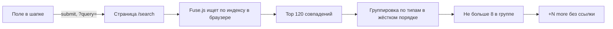
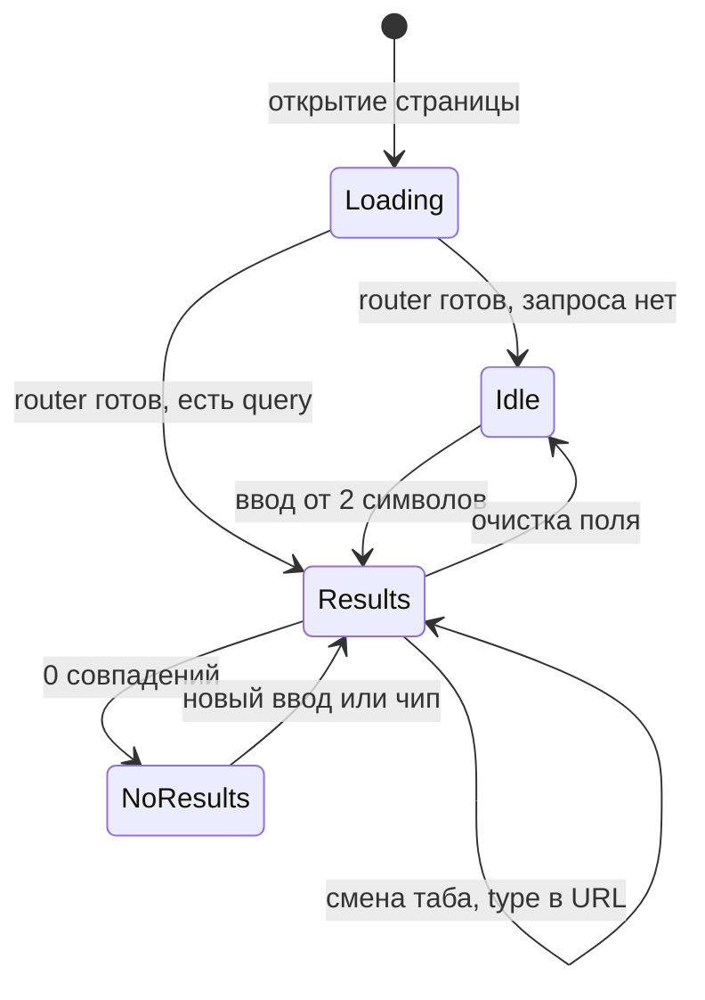

# UX-аудит страницы поиска /search

Затронутые файлы:
- `components/pages/SearchPage.tsx` — сама страница
- `lib/search/buildIndex.ts`, `lib/search/types.ts` — индекс (список всего, по чему ищем) и типы
- `pages/search.tsx` — роут (SSG, индекс собирается при билде)
- `components/layout/SiteHeader.tsx` — поле поиска в шапке (точка входа)

## Как сейчас работает поиск



Fuse.js — библиотека нечёткого поиска: находит совпадения даже с опечатками. Работает прямо в браузере, по индексу, который вшивается в страницу при сборке.

## UX-проблемы по приоритету

### P0 — ломают сценарий

1. **Первым показывается пустое состояние.** Страница статическая (SSG), поэтому на первом рендере `router.query` пуст. Человек пришёл из шапки с запросом, а видит «Type at least 2 characters…», и только потом появляются результаты. Не проверяется `router.isReady`.
2. **Результаты за пределами 8 в группе недоступны.** Надпись «+N more in Blog» — просто текст, на неё нельзя нажать. В блоге 152 поста, поэтому по широким запросам большая часть статей до пользователя не доходит.
3. **Релевантность теряется из-за жёсткого порядка групп.** Группы всегда идут так: UI Kits → Templates → Bundles → Freebies → Dashboards → Blog. Самый точный результат (часто статья) оказывается в самом низу, под 8 менее релевантными китами.
4. **URL не совпадает с тем, что на экране.** URL обновляется только по Enter. Ввод с клавиатуры и клик по чипам-подсказкам URL не меняют. Если обновить страницу, нажать «назад» или поделиться ссылкой, запрос теряется.

### P1 — мешают и вводят в заблуждение

5. **Счётчик врёт.** В `fuse.search(..., { limit: 120 })` стоит лимит 120, поэтому «Found 120 results» может значить «больше 120». При этом из-за лимита 8 на группу реально показывается меньше.
6. **Заголовок H1 «Search results» не меняется.** Он висит и тогда, когда результатов нет или запрос ещё не введён. Запроса в заголовке нет, `<title>` тоже статичный.
7. **Не видно, почему результат нашёлся.** Совпавшие слова не подсвечиваются. Fuse ищет и по описанию с `ignoreLocation`, так что в выдачу попадают элементы, где запроса не видно ни в заголовке, ни в видимых двух строках описания.
8. **Нет фильтра по типу.** Если нужны только бесплатные ресурсы или только статьи, приходится листать всю ленту.
9. **Слабый экран «ничего не найдено».** Там только три ссылки текстом. Нет популярных товаров, свежих статей, подсказок вида «возможно, вы искали» и списка частых запросов.
10. **Результаты разных типов выглядят одинаково.** Нет бейджа типа, у бесплатных ресурсов нет метки Free. У всех бандлов ссылка ведёт на один и тот же `/bundle`, без якоря на конкретный бандл.
11. **Сомнительные чипы-подсказки.** По `figma` находится почти всё, по `icons` может не найтись ничего. Подсказки захардкожены (прописаны прямо в коде) и никак не связаны с тем, что реально ищут.

### P2 — доступность, консистентность, качество кода

12. **Два элемента с `id="search"`.** Он есть и у поля в шапке, и у поля на странице. Это невалидный HTML: `label` и фокус могут цепляться не к тому полю.
13. **У поля на странице нет `aria-label`, только placeholder.** Счётчик результатов не объявляется скринридерам: нет `aria-live`.
14. **Заголовки групп сделаны тегом `<p>`, а не `<h2>`.** Скринридер не может перемещаться по группам. Кроме того, в `className` (строка 228) случайно разорвана строка, и в классы попал мусорный класс `m`.
15. **Визуальная несогласованность.** Заголовки групп задаются Tailwind-классом `text-sm` в фиксированных rem. Остальной сайт масштабируется через `em` от vw, поэтому на больших экранах подписи групп выглядят мелкими. Цвет при наведении `purple-700` — это не брендовый `--primary`.
16. **Картинка с `m-auto` в flex-строке `items-start`.** Превью центрируется по вертикали, а текст прижат к верху. Если картинки нет, текст сдвигается влево, и колонка выравнивания ломается.
17. **Поиск в шапке и на странице выглядит по-разному.** В шапке анимированный placeholder, на странице статичный «Search…». Если зайти на пустой `/search`, фокус в поле не ставится.
18. **Нет управления с клавиатуры.** Esc не очищает поле, стрелками нельзя ходить по результатам, `/` или Cmd+K не открывают поиск.
19. **Поиск по нескольким словам нестабилен.** Fuse сравнивает строку целиком, поэтому `dark dashboard` или `react table` дают шумную выдачу. Нет синонимов (`kit` / `ui kit`, `chart` / `dataviz`).
20. **Нет аналитики.** Запросы и запросы без результатов не отправляются в GA4, поэтому непонятно, что пользователи ищут и не находят.

## Варианты улучшения

### Вариант A — быстрые исправления (без редизайна)
Закрывает все P0 и часть P1/P2:
- ждать `router.isReady`, пока ждём, показывать скелетон вместо пустого состояния
- синхронизировать URL с вводом (после debounce, то есть небольшой паузы после набора) и с чипами через `router.replace`
- «+N more» превратить в кнопку «Show all N», которая раскрывает группу
- убрать лимит 120 или честно писать «120+»
- динамический H1 и `<title>`: `Results for “dashboard”`
- `h2` у групп, починить `className`, уникальный `id`, `aria-label`, `aria-live`
- выравнивание карточки и заглушка, когда нет картинки

### Вариант B — редизайн выдачи (A плюс следующее)
- блок **Top results**: 3–5 лучших результатов по скору Fuse (оценке релевантности) из любых групп, ниже остальные группы
- **табы-фильтры** `All · Blog · Freebies · UI kits · Bundles` со счётчиками, выбранный таб хранится в URL (`?type=`). Актуальная политика табов описана в разделе ниже
- **подсветка совпадений** через `includeMatches`
- единая карточка результата: бейдж типа, Free или цена, категория
- полезное «ничего не найдено»: популярные киты, свежие статьи, живые чипы
- настройка Fuse: меньше вес описания, поиск по отдельным словам (токенам), словарь синонимов
- события GA4 `search` и `search_no_results` через `lib/gtag.ts`

### Вариант C — мгновенный поиск (B плюс следующее)
- выпадающий список результатов прямо в шапке, первые 5 совпадений появляются по мере набора
- командная палитра (всплывающее окно поиска) по Cmd+K или `/`, навигация стрелками, Esc
- `/search` остаётся полной страницей для кнопки «See all results»
- индекс подгружается отдельным JSON только при первом фокусе в поле, чтобы не утяжелять каждую страницу

## Политика табов (реализовано)

Блог сейчас главный и самый наполненный раздел, UI kits давно не в приоритете. Поэтому состав и порядок табов пересобраны.

| Было | Стало | Почему |
|---|---|---|
| Таб Templates | Удалён | Индекс `TEMPLATE_PRODUCTS` дублировал `PRODUCTS`, дубликаты отсеивались, и таб всегда показывал 0 |
| Таб Dashboard с одним элементом | Входит в группу UI kits | Отдельный таб ради одного результата только шумит. Бейдж `DASHBOARD` и ссылка `/dashboard-templates/[slug]` остались |
| Жёсткий порядок UI kits первыми | `All · Blog · Freebies · UI kits · Bundles` | Порядок `SEARCH_GROUP_ORDER` в `lib/search/types.ts` отражает приоритеты контента |
| Пустые табы отключались | Пустые табы скрываются | Табы с нулём ничего не дают. Видны всегда только All и активный таб |
| Ранжирование только по скору Fuse | Блогу дан буст ×0.8 | `SCORE_BOOST` в `SearchPage.tsx` умножает скор (меньше значит лучше). От него зависят Top results и порядок групп на табе All |
| Нет фильтра внутри блога | Список «Topic» в ряду табов и кликабельная категория в строке результата | Второй ряд чипов под табами (чипы внутри чипов) убран. Нативный `select` справа от табов показывается только в табе Blog; варианты строятся из найденных статей по убыванию количества. Категория в строке статьи стала кнопкой: клик открывает таб Blog с этим фильтром. Выбор хранится в `?category=` |

Совместимость старых ссылок:
- `?type=template` и `?type=dashboard` открывают таб UI kits (`LEGACY_TAB_ALIASES` в `parseTab`)
- при смене таба параметр `category` удаляется из URL
- если в выбранной категории нет совпадений по новому запросу, фильтр сбрасывается на «All topics»
- список Topic показывается, только когда в выдаче блога больше одной категории
- на ширине до 640px список переносится под табы на всю ширину
- подписи категорий на экране приводятся к sentence case функцией `formatCategoryLabel` (`lib/search/format.ts`), значения в данных и URL не меняются
- выбор в списке Topic меняет URL через `replace`, клик по категории в строке через `push`, поэтому «Назад» возвращает вид до клика
- строка результата кликабельна через растянутую ссылку (`::after` на весь `li`), кнопка категории лежит поверх неё (`relative z-10`), вложенных интерактивных элементов нет

## Макет выдачи по варианту B

Макеты схематичные (wireframe): они показывают структуру и поведение, а не финальный визуал. Все стили берём из существующих Webflow-классов, акцентный цвет `var(--primary)` (#7c4dff).

### 1. Десктоп: таб «All», запрос `dashboard`

```
┌────────────────────────────────────────────────────────────────────────────┐
│ Home / Search                                                              │
│                                                                            │
│ Results for “dashboard”                                  ← H1, heading-h1  │
│                                                                            │
│ ┌──────────────────────────────────────────────────────────────────┬───┐   │
│ │ dashboard                                                     ✕ │ 🔍│   │
│ └──────────────────────────────────────────────────────────────────┴───┘   │
│ 47 results                                        ← aria-live, text-small  │
│                                                                            │
│ [ All 41 ]  [ Blog 28 ]  [ Freebies 4 ]  [ UI kits 9 ]                     │
│   ▲ пустые табы (например, Bundles с нулём) скрыты                         │
│   ▲ активный таб: фон --primary, белый текст       ← blog_list-filters-item│
│ ────────────────────────────────────────────────────────────────────────── │
│                                                                            │
│ Top results                                                ← h2            │
│ ┌──────────────────────┐ ┌──────────────────────┐ ┌──────────────────────┐ │
│ │ ┌──────────────────┐ │ │ ┌──────────────────┐ │ │ ┌──────────────────┐ │ │
│ │ │   16:9 превью    │ │ │ │   16:9 превью    │ │ │ │   16:9 превью    │ │ │
│ │ └──────────────────┘ │ │ └──────────────────┘ │ │ └──────────────────┘ │ │
│ │ UI KIT · $98         │ │ BLOG · UI Design     │ │ FREEBIE · Free       │ │
│ │ Neolex **dashboard** │ │ **Dashboard** UI     │ │ Admin **dashboard**  │ │
│ │ template             │ │ design guide         │ │ starter              │ │
│ │ Описание в 2 строки… │ │ Описание в 2 строки… │ │ Описание в 2 строки… │ │
│ └──────────────────────┘ └──────────────────────┘ └──────────────────────┘ │
│   ▲ 3 лучших по скору Fuse из любых типов. Показываем, только если         │
│     у лучшего совпадения высокая оценка, иначе блок скрыт                  │
│                                                                            │
│ UI kits · 9                                     See all 9 →    ← h2        │
│ ┌────────┐ UI KIT · Dashboards · $98                                       │
│ │ 4:3    │ Neolex **dashboard** template                                   │
│ │ превью │ Описание, 2 строки, найденное слово **выделено**…               │
│ └────────┘                                                                 │
│ ┌────────┐ UI KIT · Dataviz · $79                                          │
│ │        │ Hyper charts                                                    │
│ │        │ …analytics **dashboard** widgets and charts…                    │
│ └────────┘  ▲ если слово нашлось только в описании, показываем             │
│               фрагмент описания вокруг совпадения, а не его начало         │
│ … до 4 строк в группе на табе «All»                                        │
│                                                                            │
│ Blog · 28                                       See all 28 →               │
│ ┌────────┐ BLOG · UI Design · 12 min read                                  │
│ │        │ **Dashboard** UI design: Anatomy and examples                   │
│ └────────┘ Описание…                                                       │
└────────────────────────────────────────────────────────────────────────────┘
```

Что изменилось по сравнению с текущей страницей:
- H1 и `<title>` содержат сам запрос
- крестик ✕ очищает поле, Esc делает то же самое
- табы со счётчиками заменяют жёсткий порядок групп и «+N more»
- блок «Top results» поднимает самые релевантные результаты наверх, какого бы типа они ни были
- на табе «All» в каждой группе до 4 строк и ссылка «See all N →», которая переключает на нужный таб
- группы сортируются по скору лучшего результата в группе, а не по фиксированному списку

### 2. Десктоп: таб «Blog» (после клика на «See all 28 →»)

```
│ Results for “dashboard”                                                    │
│ [ dashboard                                                     ✕ | 🔍 ]   │
│ 28 results in Blog                                                         │
│                                                                            │
│ [ All 41 ]  [▓Blog 28▓]  [ Freebies 4 ]  [ UI kits 9 ]                     │
│ ────────────────────────────────────────────────────────────────────────── │
│ (▓All topics 28▓) ( UI Design 17 ) ( Startups & SaaS 6 ) ( Resources 5 )   │
│   ▲ чипы категорий блога, выбор хранится в ?category=                      │
│ ┌────────┐ BLOG · UI Design · 12 min read                                  │
│ │        │ **Dashboard** UI design: Anatomy and examples                   │
│ └────────┘ …                                                               │
│ … 20 результатов                                                           │
│                                                                            │
│                   [ Show 20 more ]     ← button secondary                  │
```

- URL: `/search?query=dashboard&type=blog`. Если обновить страницу, нажать «назад» или отправить ссылку, откроется то же самое
- без групп и блока Top results: плоский список по релевантности
- пагинация кнопкой «Show more» по 20 результатов, как в `TemplateGrid`
- табы с нулём результатов скрываются. All и активный таб видны всегда, даже с нулём, чтобы пользователь понимал, где находится
- чипы категорий: первый «All topics N», дальше категории по убыванию количества статей. URL: `/search?query=dashboard&type=blog&category=UI%20Design`

### 3. Ничего не найдено: запрос `crm pipline`

```
│ No results for “crm pipline”                                    ← H1       │
│ [ crm pipline                                                   ✕ | 🔍 ]   │
│                                                                            │
│ Did you mean “crm pipeline”?                    ← ссылка, если есть        │
│                                                   близкое совпадение       │
│ Try fewer or broader words, or pick a popular search:                      │
│ ( dashboard )  ( charts )  ( mobile app )  ( react )  ( free )             │
│   ▲ чипы — это ссылки, они обновляют URL                                   │
│                                                                            │
│ Fresh from the blog                                       ← h2             │
│ • Заголовок свежей статьи 1                                                │
│ • Заголовок свежей статьи 2                                                │
│ • Заголовок свежей статьи 3                                                │
│   ▲ блог идёт первым, это главный раздел сайта                             │
│                                                                            │
│ Popular UI kits                                           ← h2             │
│ ┌──────────┐ ┌──────────┐ ┌──────────┐ ┌──────────┐                        │
│ │ Template │ │ Template │ │ Template │ │ Template │   ← TemplateCard       │
│ │ Card     │ │ Card     │ │ Card     │ │ Card     │                        │
│ └──────────┘ └──────────┘ └──────────┘ └──────────┘                        │
│                                                                            │
│ Still can’t find it? [ Contact us ]     ← открывает ContactModal           │
```

- «Did you mean»: повторный пои��к Fuse с более мягким порогом совпадения (threshold) для каждого слова запроса отдельно
- популярные киты берём из `data/slider-products.ts` (главная уже их показывает)
- кнопка «Contact us» открывает существующую модалку через `ContactModalContext`
- отправляется событие GA4 `search_no_results` с запросом

### 4. Пустая страница /search без запроса

```
│ Search Setproduct                                               ← H1       │
│ [ Try “dashboard”, “charts” or “ios”…                             | 🔍 ]   │
│   ▲ фокус в поле ставится автоматически                                    │
│ Search across N items: M blog posts, plus UI kits, freebies and bundles.   │
│   ▲ N и M считаются из индекса                                             │
│                                                                            │
│ Popular searches                                                           │
│ ( dashboard )  ( charts )  ( mobile app )  ( react )  ( free )  ( ios )    │
│                                                                            │
│ Browse by type                                                             │
│ [ Blog → ]  [ Freebies → ]  [ UI kits → ]  [ Bundles → ]  [ Dashboards → ] │
```

Пока роутер не готов (`router.isReady === false`), вместо этого экрана показываем 3 серые заглушки-скелетона. Так пропадает мигание текста «Type at least 2 characters».

### 5. Мобильная версия (ширина до 767px)

```
┌──────────────────────────────┐
│ Results for “dashboard”      │
│ [ dashboard          ✕ | 🔍 ]│
│ 47 results                   │
│ ◀ [All 41][Blog 28][Freeb…▶  │  ← горизонтальный скролл табов
│ ──────────────────────────── │
│ Top results                  │
│ ┌──────────────────────────┐ │
│ │ ┌──────┐ UI KIT · $98    │ │  ← на мобильном Top results
│ │ │превью│ Neolex dashboard│ │    становятся списком,
│ │ └──────┘ template        │ │    а не сеткой из 3 колонок
│ └──────────────────────────┘ │
│ UI kits · 9      See all 9 → │
│ ┌──────┐ UI KIT · $98        │
│ │ 72px │ Neolex dashboard…   │
│ └──────┘ Описание 1 строка   │
└──────────────────────────────┘
```

- табы скроллятся по горизонтали, активный таб прокручивается в видимую область
- превью в строке уменьшаются до 72px, описание обрезается до 1 строки
- поле поиска становится `sticky` под шапкой, когда страница прокручена вниз

### 6. Анатомия строки результата (единая для всех типов)

```
┌────────┐  TYPE BADGE · Category · Price or Free or Read time
│ превью │  Заголовок с **подсветкой**, максимум 2 строки
│  4:3   │  Описание или фрагмент вокруг совпадения, 2 строки
└────────┘
```

| Тип | Бейдж | Правая метка | Ссылка |
|---|---|---|---|
| UI kit | `UI KIT` | цена `$98` | `/templates/[slug]` |
| Freebie | `FREEBIE` | `Free` в цвете `--primary` | `/freebies/[slug]` |
| Bundle | `BUNDLE` | цена | `/bundle#[slug]` (нужен якорь) |
| Dashboard | `DASHBOARD` | пусто | `/dashboard-templates/[slug]`, в выдаче входит в группу UI kits |
| Blog | `BLOG` | `12 min read` | `/blog/[slug]` |

Правила:
- если картинки нет, вместо превью серый блок с иконкой типа, чтобы колонка текста не сдвигалась
- превью выравнивается по верху (`items-start`), без `m-auto`
- при наведении заголовок красится в `var(--primary)`, превью слегка увеличивается (как сейчас)
- подсветка: `<mark>` с фоном `var(--light-primary)` и без жирного, чтобы не спорить с заголовком
- вся строка — одна ссылка, у ссылки видимое кольцо фокуса при навигации с клавиатуры

### Поведение и состояния



- ввод с клавиатуры: ��ауза 250 мс после набора, затем `router.replace` с `query`, история браузера не засоряется
- клик по табу: `router.push` с `type`, чтобы кнопка «назад» возвращала на предыдущий таб
- событие GA4 `search` (с параметрами `search_term` и `results_count`) отправляется один раз после паузы, а не на каждую букву

### Что нужно доработать в данных для макета

- `lib/search/types.ts`: для блога добавить поле `readingTime`, для бесплатных ресурсов флаг `isFree`
- `lib/search/buildIndex.ts`: заполнить эти поля; для бандлов ссылка `/bundle#slug`
- `components/pages/BundlePage.tsx`: проставить `id={slug}` у карточек бандлов, чтобы якорь работал
- новый файл `lib/search/synonyms.ts`: с��оварь синонимов (`kit` / `ui kit`, `chart` / `dataviz` / `graph`, `app` / `mobile`)
- список популярных запросов положить в `data/search-suggestions.ts`, после подключения GA4 обновлять его по реальным данным

## Рекомендация
Начать с **A** (ломается базовый сценарий), затем сделать **B** отдельной веткой коммитов. **C** имеет смысл, только если GA4 после B покажет, что поиском действительно пользуются.

## Ограничения проекта
- новые npm-зависимости не нужны, хватает Fuse.js
- стилизовать через Webflow-классы и `var(--primary)`, без новых `*.module.css`
- тексты интерфейса писать в sentence case
- каждое логическое изменение делать отдельным коммитом, без push
